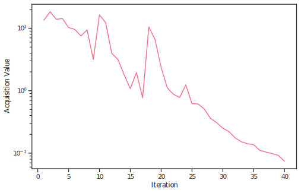

Cosmological Likelihoods (through Cobaya)
==========================================

This example demonstrates how to use BOBE with realistic cosmological likelihoods interfaced
through the Cobaya package. We'll estimate the Bayesian evidence for the 
standard ΛCDM model using the Planck 2018 lensing + lowl TT+EE + highl_plik.TTTEEE_lite_native nuisance marginalised likelihood (Planck-lite).

Prerequisites
-------------

.. note::
   This example requires `Cobaya <https://cobaya.readthedocs.io/>`_. You'll also need the Planck likelihoods installed. Follow the the instructions in the Cobaya documentation for data setup.

Problem Description
-------------------

We're testing a cosmological model with the following setup:

- **Likelihood**: Planck 2018 (lowl TT+EE, highl plik TTTEEE lite, lensing)
- **Model**: Standard ΛCDM (flat universe)
- **Parameters**: 6 cosmological parameters

  - :math:`\Omega_b h^2`: Baryon density
  - :math:`\Omega_c h^2`: Cold dark matter density  
  - :math:`H_0`: Hubble parameter
  - :math:`\log(10^{10} A_s)`: Primordial scalar amplitude
  - :math:`n_s`: Scalar spectral index
  - :math:`\tau`: Optical depth to reionization

Cobaya YAML Configuration
--------------------------

Prepare your YAML file as you would usually do for Cobaya, specifying the theory, likelihood and params block. That defines the cosmological model, likelihoods, and parameters. 
Here's the structure of ``LCDM_lite.yaml``:

.. code-block:: yaml

   theory:
     camb:
       path: 'global'
       extra_args:
         halofit_version: mead
         bbn_predictor: PArthENoPE_880.2_standard.dat
         lens_potential_accuracy: 1
         num_massive_neutrinos: 1
         nnu: 3.044
   likelihood:
     planck_2018_lowl.TT: null
     planck_2018_lowl.EE: null
     planck_2018_highl_plik.TTTEEE_lite_native: null
     planck_2018_lensing.native: null
   params:
     omch2:
       latex: \Omega_\mathrm{c} h^2
       prior:
         min: 0.11
         max: 0.13
       ref:
         dist: norm
         loc: 0.1186
         scale: 0.0005
     ombh2:
       latex: \Omega_\mathrm{b} h^2
       prior:
         min: 0.021
         max: 0.023
       ref:
         dist: norm
         loc: 0.0222
         scale: 0.0001
     H0:
       latex: H_0
       prior:
         min: 64
         max: 72
       ref:
         dist: norm
         loc: 67.7
         scale: 0.05
     logA:
       latex: \log(10^{10} A_\mathrm{s})
       prior:
         min: 2.98
         max: 3.10
       ref:
         dist: norm
         loc: 3.041
         scale: 0.001
     As:
       value: 'lambda logA: 1e-10*np.exp(logA)'
       latex: A_\mathrm{s}
     ns:
       latex: n_\mathrm{s}
       prior:
         min: 0.94
         max: 0.99
       ref:
         dist: norm
         loc: 0.965
         scale: 0.002
     tau:
       latex: \tau_\mathrm{reio}
       prior:
         min: 0.03
         max: 0.08
       ref:
         dist: norm
         loc: 0.055
         scale: 0.003
     A_planck: # Planck calibration parameter fixed to 1 here, can remove this block to use the default Gaussian prior
        value: 1.0

Key YAML elements:

- **theory**: Specifies CAMB for computing cosmological observables
- **likelihood**: Lists all likelihoods to use
- **params**: Defines priors (``min``/``max`` for uniform, or ``dist: norm`` for Gaussian) and reference distributions (``ref``) used by Cobaya to generate initial points for sampling (BOBE can also use this).

See the `Cobaya documentation <https://cobaya.readthedocs.io/>`_ for more details on setting up cosmological models.

Configure and run BOBE
--------------------

This example is based on ``examples/Planck_lite_LCDM.py``.

.. code-block:: python

   import os
   os.environ["XLA_FLAGS"] = "--xla_force_host_platform_device_count={}".format(
       os.cpu_count()
   )
   from BOBE import BOBE
   from BOBE.utils.core import renormalise_log_weights, scale_from_unit
   import time
   import matplotlib.pyplot as plt
   from getdist import MCSamples, plots, loadMCSamples
   import numpy as np

   # Set up the cosmological likelihood
   cobaya_input_file = './cosmo_input/LCDM_lite.yaml'
   likelihood_name = 'Planck_lite_LCDM'
   
   start = time.time()
   print("Starting BOBE run...")

   # Pass Cobaya YAML file path directly to BOBE
   sampler = BOBE(
       loglikelihood=cobaya_input_file,
       likelihood_name=likelihood_name,
       resume=False,
       resume_file=f'{likelihood_name}',
       save_dir='./results/',
       save=True,
       verbosity='INFO',
       n_cobaya_init=4,
       n_sobol_init=8,
       use_clf=True,
       clf_type='svm',
       seed=10,
   )
   
   results = sampler.run(
       acq='wipstd',
       min_evals=25,
       max_evals=250,
       fit_n_points=6,
       batch_size=2,
       ns_n_points=6,
       num_hmc_warmup=256,
       num_hmc_samples=2048,
       mc_points_size=256,
       logz_threshold=0.1,
   )

   end = time.time()

   if results is not None:  # when running in MPI mode, only rank 0 returns results

       gp = results['gp']
       logz_dict = results.get('logz', {})
       likelihood = results['likelihood']
       results_manager = results['results_manager']
       samples = results['samples']
       param_bounds = likelihood.param_bounds
       param_list = likelihood.param_list
       param_labels = likelihood.param_labels
       ndim = len(param_list)

       manual_timing = end - start

       print("\n" + "="*60)
       print("RUN COMPLETED")
       print(f"Final LogZ: {logz_dict.get('mean', 'N/A'):.4f}")
       if 'upper' in logz_dict and 'lower' in logz_dict:
           print(f"LogZ uncertainty: ±{(logz_dict['upper'] - logz_dict['lower'])/2:.4f}")

       print("="*60)
       print(f"Manual timing: {manual_timing:.2f} seconds ({manual_timing/60:.2f} minutes)")

       reference_samples = loadMCSamples(
           './cosmo_input/chains/Planck_lite_mcmc',
           settings={'ignore_rows': 0.3, 'label': 'MCMC'}
       )

       # Create MCSamples from BOBE results
       sample_array = samples['x']
       weights_array = samples['weights']
       BOBE_Samples = MCSamples(samples=sample_array, names=param_list, labels=param_labels,
                                   weights=weights_array, 
                                   ranges= dict(zip(param_list,param_bounds.T)))

       # Create parameter samples plot
       print("Creating parameter samples plot...")
       
       plt.rcParams['text.usetex'] = True
       plt.rcParams['font.family'] = 'serif'

       g = plots.get_subplot_plotter(subplot_size=2.5, subplot_size_ratio=1)
       g.settings.legend_fontsize = 16
       g.settings.axes_fontsize = 16
       g.settings.axes_labelsize = 16
       g.triangle_plot([BOBE_Samples,reference_samples], filled=[True, False],
                   contour_colors=['#006FED', 'black'], contour_lws=[1, 1.5],
                   legend_labels=['BOBE', 'MCMC']) 
       # add scatter points for gp training data
       points = scale_from_unit(gp.train_x, param_bounds)
       for i in range(ndim):
           for j in range(i+1, ndim):
               ax = g.subplots[j, i]
               ax.scatter(points[:, i], points[:, j], alpha=0.75, color='red', s=4)
       g.export(f'./results/{likelihood.name}_samples.pdf')

.. figure:: Planck_lite_LCDM_samples.svg
   :align: center
   :width: 90%
   
   Triangle plot comparing BOBE posterior samples (blue filled contours) with MCMC reference samples (black contours). Red scatter points show the GP training data locations. The plot demonstrates excellent agreement between BOBE and the reference MCMC sampler across all six cosmological parameters.

.. code-block:: python

       # Print timing analysis
       print("DETAILED TIMING ANALYSIS")

       timing_data = results_manager.get_timing_summary()

       print(f"Automatic timing: {timing_data['total_runtime']:.2f} seconds ({timing_data['total_runtime']/60:.2f} minutes)")
       print("Phase Breakdown:")
       print("-" * 40)  
       for phase, time_spent in timing_data['phase_times'].items():
           if time_spent > 0:
               percentage = timing_data['percentages'].get(phase, 0)
               print(f"{phase:25s}: {time_spent:8.2f}s ({percentage:5.1f}%)")

       # Plot acquisition data
       acquisition_data = results_manager.get_acquisition_data()
       iterations = np.array(acquisition_data['iterations'])
       values = np.array(acquisition_data['values'])
       fig, ax = plt.subplots(1, 1, figsize=(8, 5))
       ax.plot(iterations, values,  linestyle='-')
       ax.set_yscale('log')
       ax.set_xlabel(r'Iteration')
       ax.set_ylabel(r'Acquisition Value')
       plt.savefig(f"./results/{likelihood.name}_acquisition.pdf", bbox_inches='tight')

   
   Evolution of the WIPStd acquisition function values during optimization. The acquisition value decreases as the GP surrogate becomes more confident about the posterior region, indicating successful convergence toward the high-likelihood area of parameter space.

Expected Results
~~~~~~~~~~~~~~~~~~~

For standard ΛCDM with Planck lite:

- **Convergence**: Typically requires 100-200 evaluations with these settings. The logZ value should be approximately :math:`\log Z \approx -520` (exact value may vary slightly due to nested sampler stochasticity).

Expected Runtime
~~~~~~~~~~~~~~~~~~~

For the Planck lite likelihood (each evaluation ~0.5-1 second), this run should take around 2-5 minutes. Note: total runtime may vary according to your hardware specifications.

Running with MPI
~~~~~~~~~~~~~~~~~~~

While this example does not really require MPI, for more expensive cosmological likelihoods it is recommended to use MPI parallelisation. 
In MPI mode, multiple processes can evaluate the true likelihood at the points proposed by the acquisition function (use as many processes as the acquisition batch size) and do GP fitting restarts in parallel, significantly speeding up the run.

.. code-block:: bash

   # Install MPI support (from BOBE source directory)
   pip install -e '.[mpi]'
   
   # Run with 4 processes
   mpirun -n 4 python examples/Planck_lite_LCDM.py

Key Configuration Parameters
~~~~~~~~~~~~~~~~~~~

The example demonstrates important settings for cosmological applications:

- **n_cobaya_init=4, n_sobol_init=8**: Using both Cobaya reference and Sobol points to initialize the GP
- **min_evals=25, max_evals=250**: Min and max number of likelihood evaluations to perform
- **fit_n_points=6**: Update GP every 6 likelihood evaluations
- **batch_size=2**: Evaluate 2 points per acquisition step
- **ns_n_points=6**: Run nested sampling after every 6 likelihood evaluations to check for convergence once the acquisition function reaches the logz threshold
- **num_hmc_warmup=256, num_hmc_samples=2048**: NUTS sampling for Monte Carlo acquisition function
- **logz_threshold=0.1**: Evidence convergence threshold

For cosmological likelihoods, **you should use** ``use_clf=True``. 
The classifier filters out parameter regions where likelihood evaluations may return -inf or extremely low likelihoods and focuses the GP on the high-likelihood posterior region.
The SVM classifier (``clf_type='svm'``) is used in this example and is always available without additional dependencies. The classifier threshold setting strategy is explained in our `paper <https://arxiv.org/abs/2512.xxxx>`_ and follows the one used in `Gpry <https://github.com/jonaselgammal/GPry>`_.

.. Troubleshooting
.. ---------------

.. Slow Convergence
.. ~~~~~~~~~~~~~~~~

.. If convergence is slow:

.. 1. Increase ``n_cobaya_init`` to 16-32 for better initialization near the posterior
.. 2. Reduce ``logz_threshold`` from 0.1 to 0.05 for stricter convergence
.. 3. Increase ``mc_points_size`` to 1024 for better acquisition optimization
.. 4. Try more frequent GP updates: reduce ``fit_n_points`` to 4 or lower
.. 5. Increase ``num_hmc_samples`` to 4000-8000 for better posterior exploration

.. Likelihood Failures
.. ~~~~~~~~~~~~~~~~~~~

.. If you see many ``-inf`` values:

.. 1. Check your Cobaya YAML file paths and likelihood names are correct
.. 2. Verify Cobaya data files are properly installed
.. 3. Check parameter priors don't exclude the posterior region
.. 4. The classifier will help filter these out once it trains

.. Memory Issues
.. ~~~~~~~~~~~~~

.. If you run out of memory:

.. 1. Reduce ``max_gp_size`` to 100-200
.. 2. Reduce ``num_hmc_samples`` and ``mc_points_size``
.. 3. Save intermediate results frequently with ``save=True``

.. Next Steps
.. ----------

.. - Compare evidence to alternative models (e.g., ΛCDM+Ωk, wCDM)
.. - Experiment with different ``logz_threshold`` values for convergence
.. - Try the **Planck+DESI** example for a more complex likelihood
.. - Use MPI parallelization for expensive likelihoods
.. - Monitor convergence with the acquisition value plot 
