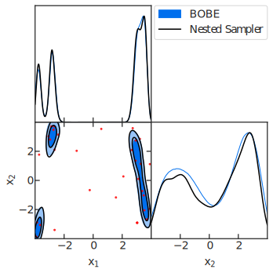
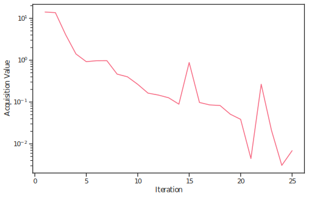

In Depth Tutorial: Computing the Bayesian evidence for the Himmelblau Function
==================================================================================

This tutorial demonstrates the basic usage of BOBE through a classic optimization problem: the Himmelblau function. This example is based on the ``examples/Himmelblau.py`` file and shows how to set up and run a Bayesian optimization loop using the BOBE framework.

The Himmelblau function is a well-known multi-modal test function in optimization that has four global minima, making it challenging for optimization algorithms. 
In this example, we test BOBE's performance on this 2D function.

The Himmelblau function (in loglikelihood form) is defined as:

.. math::

   \log \mathcal{L}(x_1, x_2) = -0.5 \cdot (a \cdot r_1 + r_2)

where 

.. math::

   r_1(x_1, x_2) = (x_1 + x_2^2 - 7)^2

   r_2(x_1, x_2) = (x_1^2 + x_2 - 11)^2

and

:math:`x_1, x_2 \in [-4, 4]` and :math:`a = 0.1` is a scaling factor.

By the end of this tutorial, you will understand:

- How to define a likelihood function for BOBE
- How to run the BOBE optimization loop
- How to analyze and visualize the results

Setup and Imports
------------------

First, let's import all the necessary libraries and set up the environment.

.. code-block:: python

   import os
   os.environ["XLA_FLAGS"] = "--xla_force_host_platform_device_count={}".format(
       os.cpu_count()
   ) # for jax on cpu, set number of devices to number of cores
   from BOBE import BOBE
   from BOBE.utils.core import renormalise_log_weights, scale_from_unit
   import time
   import matplotlib.pyplot as plt
   from getdist import MCSamples, plots
   import numpy as np
   from dynesty import DynamicNestedSampler

Define the Likelihood
------------------

Now let's define our target function—the 2D Himmelblau function.

.. code-block:: python

   # Scaling factor for the Himmelblau function
   afac = 0.1

   def loglike(X, slow=True):
       """
       The Himmelblau log-likelihood function.
       
       Original form: f(x,y) = (x² + y - 11)² + (x + y² - 7)²
       
       Parameters:
       -----------
       X : array-like, shape (2,)
           Input parameters [x1, x2]
       slow : bool
           If True, add artificial delay (useful for testing expensive likelihoods)
       
       Returns:
       --------
       float : Log-likelihood value
       """
       r1 = (X[0] + X[1]**2 - 7)**2
       r2 = (X[0]**2 + X[1] - 11)**2
       
       if slow:
           time.sleep(4)  # Artificial delay of 4 seconds for simulating an expensive likelihood
       
       return -0.5 * (afac * r1 + r2)

   # Problem setup
   ndim = 2
   param_list = ['x1', 'x2']
   param_labels = ['x_1', 'x_2']
   param_bounds = np.array([[-4, 4], [-4, 4]]).T  # Shape: (2, ndim)
   likelihood_name = 'Himmelblau'

   print("Starting BOBE run...")

Configure and Run BOBE
------------------

Now let's set up the BOBE configuration and run the optimization. We'll use the default WIPStd (Weighted Integrated Posterior Standard Deviation) acquisition function which is a cheap and approximate measure of :math:`\Delta \log Z` (see our `paper <https://arxiv.org/abs/2512.xxxx>`_ for details).
When the value of this acquisition function drops below the provided logz_threshold, BOBE will start running nested sampling on the GP surrogate to get a precise estimate of the evidence and its uncertainty. If this uncertainty is below the threshold for a specified number of successive iterations, BOBE will declare convergence and stop.

.. code-block:: python

   start = time.time()

   # Initialize BOBE instance
   bobe = BOBE(
       loglikelihood=loglike,
       param_list=param_list,
       param_bounds=param_bounds,
       param_labels=param_labels,
       likelihood_name=likelihood_name, # name for saving outputs
       n_sobol_init=8,
       seed=42,
       save_dir='./results/', # directory to save results
       save=True,
   )
   
   # Run optimization with convergence and run settings
   results = bobe.run(
       acq='wipstd',             # Acquisition function (default)
       min_evals=25,             # Minimum evaluations before checking convergence
       max_evals=250,            # Maximum function evaluations
       logz_threshold=0.01,      # Evidence convergence threshold
       fit_n_points=4,           # Refit GP every 4 likelihood evaluations
       batch_size=2,             # Sequential acquisition, n>1 for batch acquisition
       ns_n_points=4,            # Run nested sampling every 4 likelihood evaluations once the acquisition function reaches the logz threshold
       num_hmc_warmup=256,       # NUTS warmup steps
       num_hmc_samples=512,      # NUTS samples to draw per chain
       mc_points_size=128,       # Number of MC samples for acquisition function
       num_chains=4,             # Number of HMC chains
       convergence_n_iters=1,    # Number of successive iterations of \Delta\log Z < logz_threshold required to declare convergence
   )

   end = time.time()

Key Configuration Parameters
~~~~~~~~~~~~~~~~~~~~~~~~~~~~~

**BOBE Initialization Parameters**

- **loglikelihood**: The likelihood function
- **param_list**: List of parameter names (e.g., ``['x1', 'x2']``)
- **param_bounds**: Array of shape ``(2, ndim)`` with lower and upper bounds for each parameter
- **param_labels**: Optional LaTeX labels for parameters (used in plots)
- **likelihood_name**: Name used for output files
- **n_sobol_init**: Number of initial Sobol quasi-random points to sample (8 in this example)
- **seed**: Random seed for reproducibility
- **save_dir**: Directory for saving results 
- **save**: Whether to save results periodically

**Run Parameters**

- **acq**: Acquisition function to use (``'wipstd'`` in this example and is the default). WIPStd is a fast approximation of evidence uncertainty and is suited for Bayesian evidence estimation.
- **min_evals**: Minimum number of likelihood evaluations before checking convergence (25 in this example, default is 200)
- **max_evals**: Maximum number of likelihood evaluations (250 in this example, default is 1500)
- **logz_threshold**: Convergence threshold for uncertainty in log evidence (0.01 in this example). Smaller values require tighter convergence. Can be relaxed to 0.5 to 1.0. for high dimensional problems.
- **fit_n_points**: Refit GP hyperparameters after adding this many new points (4 in this example, default is 10)
- **batch_size**: Number of points to acquire per iteration, 2 in this example, 1 is for standard sequential acquisition. Larger values enable batch acquisition and the likelihood evaluations can be parallelized. However, larger batch sizes (>10-20) can reduce acquisition efficiency since the GP state is not updated with the true likelihoods of all points in the batch. The update happens only after the entire batch is evaluated.
- **ns_n_points**: Run nested sampling after adding this many new points (4 in this example, default is 10)
- **num_hmc_warmup**: Number of NUTS warmup steps for sampling the GP surrogate (256 in this example, default is 512)
- **num_hmc_samples**: Number of NUTS samples to draw per chain (512 in this example), can be increased for higher dimensions but not more than a few thousand to avoid long runtimes
- **mc_points_size**: Number of Monte Carlo points for WIPStd acquisition function (128 in this example). Since this is the number of points used to estimate the acquisition function, larger values give more accurate estimates but increase computation time. For higher dimensions can be set to ~500 but not more since this slows down acquisition optimization.
- **num_chains**: Number of MCMC chains to run in parallel (default is 4)
- **convergence_n_iters**: Number of successive iterations meeting the threshold to declare convergence (1 in this example). Increase to avoid premature convergence in challenging problems.

Analyze the Results
------------------

Let's examine what BOBE found and analyze the optimization process.

.. code-block:: python

       gp = results['gp']
       logz_dict = results.get('logz', {})
       likelihood = results['likelihood']
       results_manager = results['results_manager']
       samples = results['samples']

       manual_timing = end - start

       print("\n" + "="*60)
       print("RUN COMPLETED")
       print(f"Final LogZ: {logz_dict.get('mean', 'N/A'):.4f}")
       if 'upper' in logz_dict and 'lower' in logz_dict:
           print(f"LogZ uncertainty: ±{(logz_dict['upper'] - logz_dict['lower'])/2:.4f}")

       print("="*60)
       print(f"Manual timing: {manual_timing:.2f} seconds ({manual_timing/60:.2f} minutes)")

Running this code should produce LogZ around -3.2 and the run should take around 3 minutes with the artificial delay on and 30-60 seconds when off.

Compare with Dynesty (Reference Method)
~~~~~~~~~~~~~~~~~~~~~~

To validate our results, let's compare BOBE's evidence estimate with dynesty, a nested sampling package.

.. code-block:: python

       # Define the proper prior transform function for Dynesty
       def prior_transform(u):
            """Map [0,1]^2 to [-4,4]^2"""
            x = np.array(u)  
            return 8*x - 4

       # Create Dynesty samples to compare against
       dns_sampler = DynamicNestedSampler(
           loglike,
           prior_transform,
           ndim=ndim,
           sample='rwalk',
           logl_kwargs={'slow': False} # turn off artificial delay for dynesty
       )

       dns_sampler.run_nested(print_progress=True, dlogz_init=0.01)
       res = dns_sampler.results
       mean = res['logz'][-1]
       logz_err = res['logzerr'][-1]
       print(f"Mean logz from dynesty = {mean:.4f} +/- {logz_err:.4f}")

       dns_samples = res['samples']
       weights = renormalise_log_weights(res['logwt'])

The BOBE result should have excellent agreement with dynesty, demonstrating that BOBE provides accurate evidence estimates while using significantly fewer true likelihood evaluations.
Internally, BOBE also uses dynesty to compute the evidence from the trained GP surrogate. Since the GP surrogate is much cheaper to evaluate compared to the true likelihood, BOBE achieves large computational savings for expensive likelihoods.

Visualize Parameter Samples and Compare
~~~~~~~~~~~~~~~~~~~~~~

Let's create visualizations to compare the parameter samples from BOBE and Dynesty using GetDist.

.. code-block:: python

       reference_samples = MCSamples(
           samples=dns_samples,
           names=param_list,
           labels=param_labels,
           weights=weights,
           ranges=dict(zip(param_list, param_bounds.T))
       )

       # Create MCSamples from BOBE results
       sample_array = samples['x']
       weights_array = samples['weights']
       BOBE_Samples = MCSamples(
           samples=sample_array,
           names=param_list,
           labels=param_labels,
           weights=weights_array,
           ranges=dict(zip(param_list, param_bounds.T))
       )
       
       # Create parameter samples plot
       print("Creating parameter samples plot...")
       sns.set_theme('notebook', 'ticks', palette='husl')
       plt.rcParams['text.usetex'] = True  # optional for LaTeX-style text rendering
       plt.rcParams['font.family'] = 'serif'

       g = plots.get_subplot_plotter(subplot_size=2.5, subplot_size_ratio=1)
       g.settings.legend_fontsize = 16
       g.settings.axes_fontsize = 16
       g.settings.axes_labelsize = 16
       g.triangle_plot(
           [BOBE_Samples, reference_samples],
           filled=[True, False],
           contour_colors=['#006FED', 'black'],
           contour_lws=[1, 1.5],
           legend_labels=['BOBE', 'Nested Sampler']
       )
       
       # Add scatter points for GP training data
       points = scale_from_unit(gp.train_x, param_bounds)
       for i in range(ndim):
           for j in range(i+1, ndim):
               ax = g.subplots[j, i]
               ax.scatter(points[:, i], points[:, j], alpha=0.75, color='red', s=4)
       
       g.export(f'./results/{likelihood.name}_samples.pdf')
       print(f"✓ Corner plot saved: ./results/{likelihood.name}_samples.pdf")

   
   Triangle plot comparing BOBE posterior samples (blue filled contours) with Dynesty reference samples (black contours). Red scatter points show the GP training data locations. The plot demonstrates excellent agreement between BOBE and the reference nested sampler across both parameters.

Timing Analysis
~~~~~~~~~~~~~~~~~~~~~~

Let's analyze how the computational time was spent across different phases.

.. code-block:: python

       # Print timing analysis
       print("DETAILED TIMING ANALYSIS")

       timing_data = results_manager.get_timing_summary()

       print(f"Automatic timing: {timing_data['total_runtime']:.2f} seconds ({timing_data['total_runtime']/60:.2f} minutes)")
       print("Phase Breakdown:")
       print("-" * 40)
       for phase, time_spent in timing_data['phase_times'].items():
           if time_spent > 0:
               percentage = timing_data['percentages'].get(phase, 0)
               print(f"{phase:25s}: {time_spent:8.2f}s ({percentage:5.1f}%)")

The timing breakdown reveals (an example from a typical run):

.. code-block:: text

    DETAILED TIMING ANALYSIS
    Automatic timing: 183.86 seconds (3.06 minutes)
    Phase Breakdown:
    ----------------------------------------
    GP Training              :     4.24s (  2.3%)
    Acquisition Optimization :    14.28s (  7.8%)
    True Objective Evaluations:   144.54s ( 78.6%)
    Nested Sampling          :     7.99s (  4.3%)
    MCMC Sampling            :    10.14s (  5.5%)

Key observations:

- **Acquisition Optimization** (7.8%) typically takes a significant portion of the runtime (apart from the true likelihood evaluations) since it is run at every step
- **MCMC Sampling** (5.5%) for generating posterior samples from the GP surrogate
- **Nested Sampling** (4.3%) on the GP surrogate to compute evidence
- **GP Training** (2.3%) is minimal due to the low dimensionality
- **True Objective Evaluations** (78.6%) dominate due for expensive likelihoods

For expensive likelihoods (e.g., cosmological models typically taking more than 1 second per evaluation), the True Objective Evaluations would dominate, highlighting BOBE's efficiency in minimizing these costly calls.

Plot Acquisition Values
~~~~~~~~~~~~~~~~~~~~~~

Let's visualize how the acquisition function values evolved during optimization.

.. code-block:: python

       # Plot acquisition data
       acquisition_data = results_manager.get_acquisition_data()
       iterations = np.array(acquisition_data['iterations'])
       values = np.array(acquisition_data['values'])
       
       fig, ax = plt.subplots(1, 1, figsize=(8, 5))
       ax.plot(iterations, values, linestyle='-')
       ax.set_yscale('log')
       ax.set_xlabel(r'Iteration')
       ax.set_ylabel(r'Acquisition Value')
       plt.savefig(f"./results/{likelihood.name}_acquisition.pdf", bbox_inches='tight')
       print(f"✓ Acquisition plot saved: ./results/{likelihood.name}_acquisition.pdf")

   
   Evolution of the WIPStd acquisition function values during optimization. The acquisition value generally decreases as the GP surrogate becomes more certain about the posterior, indicating successful exploration and exploitation of the parameter space.

Summary
~~~~~~~~~~~~~~~~~~~~~~

This tutorial demonstrated the complete workflow for using BOBE on the Himmelblau function:

1. **Problem Setup**: Defined a complicated 2D test function
2. **BOBE Configuration**: Set up the BOBE sampler, runtime settings and run the sampler
3. **Validation**: Compared against Dynesty to verify accuracy
4. **Visualization**: Created triangle plots with GetDist showing GP training points and posterior samples
5. **Analysis**: Examined timing breakdown and acquisition function evolution

Key takeaways:

- **BOBE is efficient**: Uses significantly fewer true likelihood evaluations than traditional methods
- **Evidence estimation**: Provides reliable Bayesian evidence estimates with uncertainty quantification
- **Comprehensive output**: Generates detailed timing, convergence, and visualization data

Resuming a Run
------------------

To resume an interrupted run:

.. code-block:: python

   bobe = BOBE(
       loglikelihood=loglike,
       param_list=param_list,
       param_bounds=param_bounds,
       param_labels=param_labels,
       likelihood_name=likelihood_name,
       resume=True,
       resume_file=f'./results/{likelihood_name}', # assuming the previous run was saved here
       # ... other settings ...
   )
   results = bobe.run(
       # ... run settings ...
   )

BOBE will automatically load the saved GP state and samples from the specified directory and continue from where it left off.

Next Steps
------------------

- Explore the **Cosmology** example for a real-world application (ΛCDM with Planck+DESI data)
- Read the **User Guide** (in development) for in-depth explanations of features
- Check the **API Reference** for detailed configuration options

